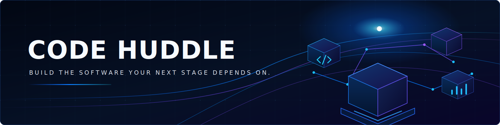

<div align="center">

# Code Huddle

### Build the software your next stage depends on.

One accountable team for product strategy, AI, design, engineering, quality, and cloud delivery.

[Website](https://www.code-huddle.com/) · [Services](https://www.code-huddle.com/services) · [Case Studies](https://www.code-huddle.com/case-studies) · [Careers](https://www.code-huddle.com/careers) · [Start a Conversation](https://www.code-huddle.com/contact)

`Founded in 2021` · `Islamabad, Pakistan` · `Building for teams worldwide`

</div>

---

## We turn product ambition into dependable software

Code Huddle is an AI and software product engineering company working with startups, SMEs, and enterprise product teams. We shape, build, launch, and improve AI products, SaaS platforms, web applications, mobile experiences, and the cloud systems behind them.

Our engagements connect product thinking with technical execution. Clients work with one team, see the decisions behind the code, review progress in working software, and retain a foundation designed to evolve after launch.

| AI products | SaaS & web platforms | Mobile experiences | Quality & cloud |
| --- | --- | --- | --- |
| LLM integrations, RAG systems, intelligent automation, and applied machine learning. | Scalable product architecture, modern web applications, APIs, and platform modernization. | Native and cross-platform products built around real user journeys and reliable integrations. | Automated testing, secure delivery pipelines, observability, infrastructure, and production readiness. |

## Open source at Code Huddle

We open-source practical engineering foundations that make product teams faster without hiding important architectural decisions.

### [`nextjs-boilerplate-kit`](https://github.com/Code-Huddle/nextjs-boilerplate-kit)

A secure, modular CLI for generating Next.js 16 and React 19 applications with the integrations a team actually selects—including Auth.js or Supabase, Prisma, Drizzle or Mongoose, Stripe, Storybook, PWA, Docker, and Sentry.

[](https://www.npmjs.com/package/nextjs-boilerplate-kit)
[](https://www.npmjs.com/package/nextjs-boilerplate-kit)
[](https://github.com/Code-Huddle/nextjs-boilerplate-kit/actions/workflows/quality.yml)
[](https://github.com/Code-Huddle/nextjs-boilerplate-kit/blob/main/LICENSE)

```bash
npx nextjs-boilerplate-kit@latest my-app
```

[Explore the repository](https://github.com/Code-Huddle/nextjs-boilerplate-kit) · [View on npm](https://www.npmjs.com/package/nextjs-boilerplate-kit) · [Report an issue](https://github.com/Code-Huddle/nextjs-boilerplate-kit/issues)

## The standard behind our work

- **Outcome before output.** We begin with the product risk, user need, and operational reality—not a predetermined technology.
- **Visible decisions.** Architecture, tradeoffs, delivery progress, and quality signals remain reviewable throughout the engagement.
- **Security and quality by design.** Trust boundaries, automation, testing, observability, and production operations are part of delivery rather than end-stage cleanup.
- **Built for change.** We favor explicit, maintainable systems that another capable team can understand, operate, and extend.

## Build, contribute, or work with us

Have a product to launch, a platform to modernize, an AI opportunity to validate, or an inherited system that needs stronger engineering ownership? [Tell us what you are building](https://www.code-huddle.com/contact).

Developers are welcome to explore our public work, open focused issues, and contribute through pull requests. If you want to join the team behind it, see our [current opportunities](https://www.code-huddle.com/careers).

<div align="center">

[LinkedIn](https://www.linkedin.com/company/code-huddle/) · [X](https://x.com/code_huddle) · [Instagram](https://www.instagram.com/code.huddle/) · [Website](https://www.code-huddle.com/)

**One crew. Many disciplines. One standard for exceptional work.**

</div>
